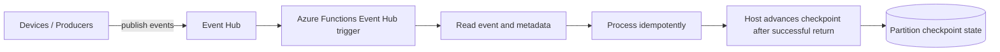
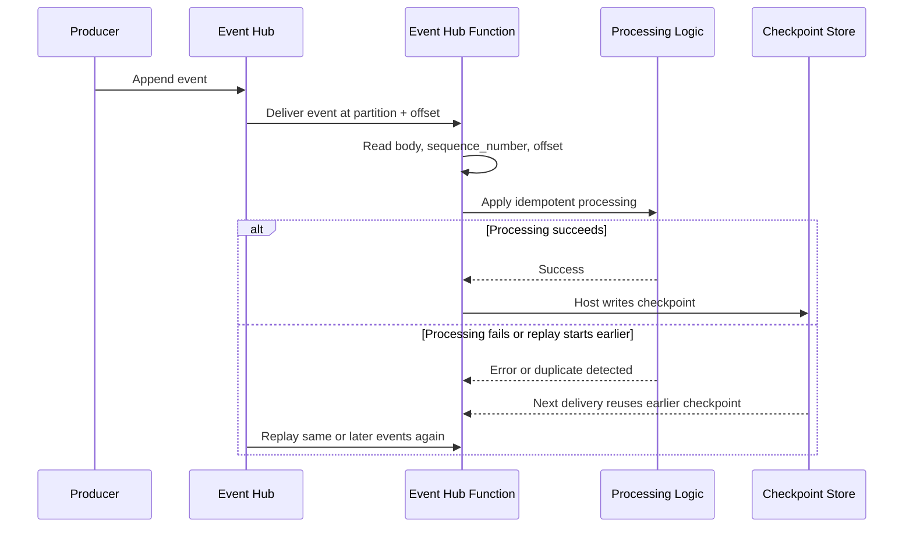

# Event Hub Checkpoint Replay

> **Trigger**: Event Hub | **State**: stateful (checkpoints) | **Guarantee**: at-least-once | **Difficulty**: advanced

## Overview
The `examples/streams-and-telemetry/eventhub_checkpoint_replay/` recipe demonstrates how Event Hub-triggered
Azure Functions behave when checkpoint progression lags, processing fails, or operators intentionally replay a
partition from an earlier offset. The function logs stream metadata, tracks offset progression per partition,
and applies idempotent processing so duplicate deliveries stay safe.

Use this pattern when stream consumers need operational replay strategies instead of assuming each event is
seen exactly once. In Azure Functions, the Event Hubs extension manages checkpoints; your code should focus on
read -> process -> checkpoint-friendly behavior by logging offsets, detecting duplicates, and only returning
success after durable business work completes.

## When to Use
- You need controlled replay after a downstream outage or bad deployment.
- You want partition-level visibility into offsets, sequence numbers, and duplicate deliveries.
- You need handlers that remain safe when checkpoints lag or consumers restart.

## When NOT to Use
- You require exactly-once side effects and cannot make processing idempotent.
- You need ad hoc random-access reads better served by Event Hubs SDK consumers outside a trigger.
- You do not need partition-aware recovery and simple append-only logging is enough.

## Architecture


## Behavior


## State Model
Checkpoint behavior is partition-scoped. Each partition can be reasoned about with these states:

- `reading`: the trigger receives an event for a partition at the current offset.
- `processing`: business logic runs and may emit logs or side effects.
- `checkpoint-pending`: processing succeeded, but the host has not yet persisted the next checkpoint.
- `replay-detected`: the function observes an offset that is lower than or equal to the last seen offset.

This state model is why replay-safe handlers matter: a single partition can revisit old offsets without affecting
others, and partitions can advance independently.

## Implementation
The sample keeps the integration surface minimal: logging only. It demonstrates three practical replay habits:

1. Read and log `partition`, `sequence_number`, and `offset` for every event.
2. Track the last observed offset in memory so local runs clearly show when a replay happened.
3. Build an idempotency key from partition and sequence metadata so duplicate deliveries are recognized.

```python
@app.event_hub_message_trigger(
    arg_name="event",
    event_hub_name="telemetry",
    connection="EventHubConnection",
)
def replay_safe_eventhub_consumer(event: func.EventHubEvent) -> None:
    partition_id = _get_partition_id(event)
    sequence_number = _coerce_int(getattr(event, "sequence_number", None))
    offset = _coerce_int(getattr(event, "offset", None))
    event_id = f"{partition_id}:{sequence_number}:{offset}"
```

If the same event arrives again, the function logs it as a replay and skips non-idempotent work.

```python
if event_id in _PROCESSED_EVENT_IDS:
    logger.warning(
        "Event Hub replay detected; duplicate delivery skipped",
        extra={"partition_id": partition_id, "sequence_number": sequence_number, "offset": offset},
    )
    return
```

## Project Structure
```text
examples/streams-and-telemetry/eventhub_checkpoint_replay/
|-- function_app.py
|-- host.json
|-- local.settings.json.example
|-- pyproject.toml
`-- README.md
```

## Config
- `EventHubConnection`: Event Hub connection string used by the trigger binding.
- `EVENTHUB_NAME`: Event Hub name. Defaults to `telemetry`.
- `AzureWebJobsStorage`: Storage used by the Functions host and checkpoint infrastructure.

## Run Locally
```bash
cd examples/streams-and-telemetry/eventhub_checkpoint_replay
python -m venv .venv
source .venv/bin/activate
pip install -e ".[dev]"
cp local.settings.json.example local.settings.json
func start
```

## Expected Output
```text
[Information] Event Hub event received {'partition_id': '0', 'sequence_number': 4102, 'offset': 1280440, 'replay_detected': false}
[Information] Event Hub event processed {'event_id': '0:4102:1280440', 'device_id': 'sensor-17', 'status': 'processed'}
[Warning] Event Hub replay detected; duplicate delivery skipped {'partition_id': '0', 'sequence_number': 4102, 'offset': 1280440}
```

## Production Considerations
- Idempotency: store processed event IDs in durable infrastructure, not memory, when replay correctness matters.
- Checkpoint timing: return success only after downstream writes complete, otherwise the host may advance checkpoints too early.
- Replay strategy: use a separate consumer group for investigation when you need to read historical data without disturbing production checkpoints.
- Observability: log partition, offset, sequence number, and replay decisions so operators can reconstruct recovery windows.
- Scaling: checkpoints are partition-based, so throughput and replay blast radius both follow partition count.

## Related Links
- [Event Hub checkpointing](https://learn.microsoft.com/en-us/azure/event-hubs/event-hubs-features#checkpointing)
- [Azure Functions Event Hubs trigger](https://learn.microsoft.com/en-us/azure/azure-functions/functions-bindings-event-hubs-trigger)
- [Event Hub Consumer](./eventhub-consumer.md)
