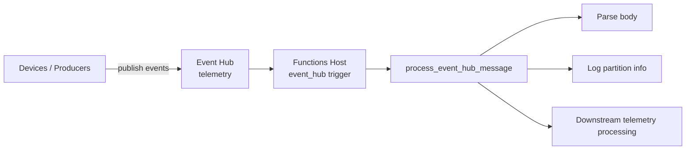
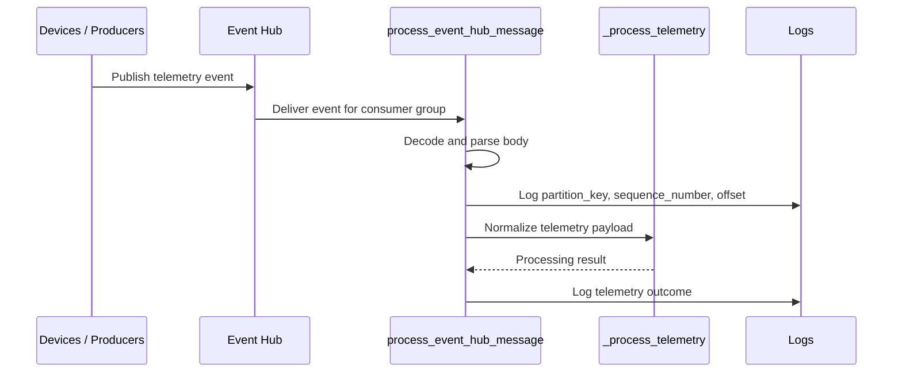

# Event Hub Consumer

> **Trigger**: Event Hub | **State**: stateless | **Guarantee**: at-least-once | **Difficulty**: beginner

## Overview
The `examples/streams-and-telemetry/eventhub_consumer/` project demonstrates stream processing with
`@app.event_hub_message_trigger` bound to the `telemetry` Event Hub. It parses event payloads,
captures stream metadata (`partition_key`, `sequence_number`, `offset`), and emits normalized logs.

Use this pattern for high-throughput append-only telemetry ingestion. Event Hub partitions and offsets
allow replay and troubleshooting, while the function implementation remains small and focused on
transforming each event into downstream business semantics.

## When to Use
- You ingest telemetry or event streams at sustained throughput.
- You need partition and offset metadata for operational traceability.
- You want near-real-time processing with consumer-group semantics.

## When NOT to Use
- You only need low-volume background jobs better served by queues.
- You require broker-managed dead-letter handling or per-message locks.
- You cannot make processing safe for replay as checkpoints advance and failures cause reprocessing.

## Architecture


## Behavior


## Implementation
The trigger receives `func.EventHubEvent`, decodes payload text, and attempts JSON parsing.
Invalid JSON is preserved as raw content so processing can continue without crashing the host.

### Prerequisites
- Python 3.10+
- Azure Functions Core Tools v4
- Azure Event Hubs namespace and hub `telemetry`
- `EventHubConnection` app setting for trigger binding

### Project Structure
```text
examples/streams-and-telemetry/eventhub_consumer/
|-- function_app.py
|-- host.json
|-- local.settings.json.example
|-- requirements.txt
`-- README.md
```

```python
@app.event_hub_message_trigger(
    arg_name="event",
    event_hub_name="telemetry",
    connection="EventHubConnection",
)
def process_event_hub_message(event: func.EventHubEvent) -> None:
    body_text = event.get_body().decode("utf-8", errors="replace")
    try:
        telemetry: dict[str, Any] = json.loads(body_text)
    except json.JSONDecodeError:
        telemetry = {"raw": body_text}
```

Metadata fields are logged explicitly. This is essential for replay analysis and diagnosing
ordering behavior when multiple partitions are active.

```python
partition_key = getattr(event, "partition_key", None)
sequence_number = getattr(event, "sequence_number", None)
offset = getattr(event, "offset", None)

logger.info(
    "Event Hub message partition_key=%s sequence_number=%s offset=%s",
    partition_key,
    sequence_number,
    offset,
)
```

`_process_telemetry` keeps transformation logic isolated and testable.

## Run Locally
```bash
cd examples/streams-and-telemetry/eventhub_consumer
pip install -r requirements.txt
func start
```

## Expected Output
```text
[Information] Event Hub message partition_key=device-a sequence_number=58421 offset=129783808
[Information] Telemetry processed: metric=temperature value=23.4 status=recorded
[Information] Event Hub message partition_key=device-b sequence_number=90211 offset=223177564
[Information] Telemetry processed: metric=humidity value=47.0 status=recorded
```

## Production Considerations
- Scaling: partition count drives maximum parallelism; align it with expected throughput.
- Retries: checkpoint progression means failed processing can replay events; keep handlers repeatable.
- Idempotency: use `partition_key + sequence_number` to detect duplicate processing.
- Observability: emit offset, sequence, and processing latency to support replay and lag diagnostics.
- Security: use RBAC with managed identity and scope receiver permissions to specific hubs.

## Related Links
- Microsoft Learn: https://learn.microsoft.com/en-us/azure/azure-functions/functions-bindings-event-hubs-trigger
- [Concurrency Tuning](../runtime-and-ops/concurrency-tuning.md)
- [Service Bus Worker](../messaging-and-pubsub/servicebus-worker.md)
- [Change Feed Processor](../data-and-pipelines/change-feed-processor.md)
