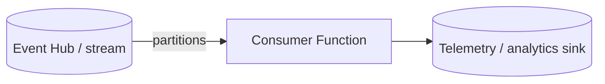

# Streams & Telemetry

Use this category for append-only event streams, telemetry pipelines, and high-throughput ingestion. These recipes focus on partitioned consumers and stream-oriented processing models.

## Category map

| Recipe | Trigger | Difficulty |
| --- | --- | --- |
| [Event Hub Consumer](./eventhub-consumer.md) | Event Hub trigger | Intermediate |
| [Event Hub Batch Window](./eventhub-batch-window.md) | Event Hub batch | Intermediate |
| [Event Hub Checkpoint Replay](./eventhub-checkpoint-replay.md) | Event Hub checkpoint | Advanced |
